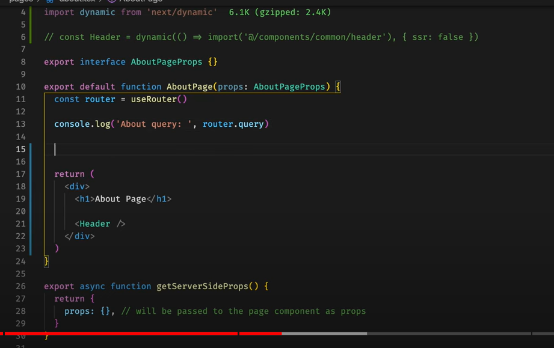

# Color & contrast


help users see and interpret your app’s content, interact with the right elements, and understand actions



Color can help communicate mood, tone, and critical information. Primary, secondary, and accent colors can be selected to support usability.



The contrast ratio between a color and its background ranges from 1-21 based on its luminance (the intensity of light emitted) according to the World Wide Web Consortium (W3C).


<figure><figcaption></figcaption></figure>

Some non-text elements, such as button containers, should meet a contrast ratio of 3:1 between their container color and the color of their background

.png>).png>)

<figure><figcaption>
FAB: floating action button (it's ok in this case)
</figcaption></figure>

.png>)
